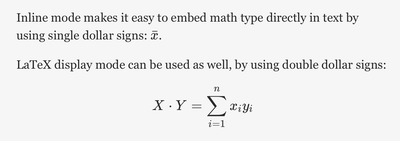
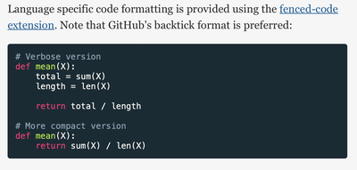
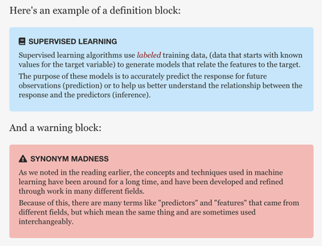
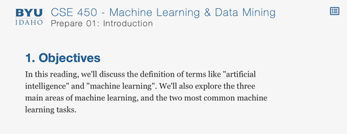

# CSE 450
This repository holds the public course materials for CSE 450.

## Overview
The materials for this course may be found in the `/source` folder. Most content is written in [markdown](https://www.markdownguide.org/basic-syntax/) format, a popular markup language with plain text formatting.

The course's build toolchain copies all directories and files from the `/source` folder to the `/docs` folder. The contents of this folder are automatically published to the [course site published on GitHub Pages](http://byui-cse.github.io/cse450-course/).

All markdown files are transformed by the build script into HTML. A default template is used for this transformation (`/templates/default.html`). The default template loads a few CSS and JS libraries, such as:

- LaTeX typesetting using Khan Academy's [Katex library](https://katex.org)
- Icon fonts via the [FontAwesome icon library](https://fontawesome.com)
- Code syntax highlighting provided by the [Highlight.js library](https://highlightjs.org)
- Automatic smart quote transformation via [smartquotes.js](https://smartquotes.js.org)

## Building the Site
After making changes, the build process can be run from the repository root by typing:

	make

Settings for this build process are stored in the `settings.cfg` file. The build script is written in Python: `/build-toolchain/build-site.py`.

## Template and Metadata

The transformed HTML data is inserted into the template wherever the `{{CONTENT}}` placeholder is found.

Additional placeholders include `{{TITLE}}`, `{{TOC}}`, and `{{BODYCLASS}}`.

When the markdown file is parsed, metadata at the top of the file is indexed by the [meta-data](https://python-markdown.github.io/extensions/meta_data/) markdown extension.

	---
	title: Prepare 01: Introduction
	template: ./templates/some-template.html
	body-class: index-page
	---

Any metadata tags may be included in the metadata section, but the only values currently used by the build toolchain are `title`, `tempalte`, and `body-class`. 

The `title` and `body-class` values are inserted into the template at their corresponding placeholders.

The `template` value may be used to override the HTML template used for a particular markdown file. To do so, simply specify the path to the desired template in the markdown file's header. The path should be relative to the repository's root folder.

New templates should generally only be used if you need a significant change to the structure of the HTML. 

If you only need page-specific styling, the body-class metadata value will allow you to selectively style pages based on the class of their `body` tags.


## Markdown Extensions

Aside from the [standard markdown syntax](https://www.markdownguide.org/basic-syntax/), the build toolchain provides some additional extensions. Note that these extensions simply output raw HTML. 

All styling is either provided by external libraries or CSS files linked in the default template.

### KaTeX Equation Support

LaTeX like formatting is provided for the default template by Khan Academy's [Katex library](https://katex.org). Equations may be embeded in markdown using one of two formats.

Inline mode makes it easy to embed math type directly in text by using single dollar signs: `$ \bar{x} $`.

LaTeX display mode can be used as well, by using double dollar signs:

	$$ X \cdot Y = \sum_{i=1}^{n} x_iy_i $$



### Syntax highlighting

Language specific code formatting is provided using the [fenced-code extension](https://python-markdown.github.io/extensions/fenced_code_blocks/). Note that GitHub's backtick format is preferred: 

	```python
	# Verbose version
	def mean(X):
	    total = sum(X)
	    length = len(X)

	    return total / length

	# More compact version
	def mean(X):
	    return sum(X) / len(X)
	```



### Footnote support

Footnotes can be used according to the standard [footnotes extension](https://python-markdown.github.io/extensions/footnotes/) syntax:

	"...as the number of demonstrations has mounted, it has become clear 
	that it is comparatively easy to make computers exhibit adult-level 
	performance in solving problems on intelligence tests or playing 
	checkers, and difficult or impossible to give them the skills of a 
	one-year-old when it comes to perception and mobility." [^1]
	
	...
	
	[^1]: [Mind Children, by Hans Moravec (Harvard University Press, 1988)](http://www.hup.harvard.edu/catalog.php?isbn=9780674576186&content=reviews)


...


### Admonition Blocks

[Admonition blocks](https://python-markdown.github.io/extensions/admonition/) allow you to specify
structured asides, notes, warnings, etc...

Here's an example of a definition block:

	!!! def "Supervised Learning"

		Supervised learning algorithms use *labeled* training data, 
		(data that starts with known values for the target variable) 
		to generate models that relate the features to the target. 

		The purpose of these models is to accurately predict the 
		response for future observations (prediction) or to help 
		us better understand the relationship between the response 
		and the predictors (inference). 

And a warning block:

	!!! warning "Synonym Madness"
		
		As we noted in the reading earlier, the concepts and techniques 
		used in machine learning have been around for a long time, and 
		have been developed and refined through work in many different 
		fields. 

		Because of this, there are many terms like "predictors" and 
		"features" that came from different fields, but which mean 
		the same thing and are sometimes used interchangeably.



The format for these blocks is:

	!!! <type> "TITLE"

		Content

Generated HTML is in this format:

	<div class="admonition warning">
		<p class="admonition-title">Synonym Madness</p>
		<p>As we noted in the reading earlier, the concepts and 
		   techniques used in machine learning have been around for a 
		   long time, and have been developed and refined through work 
		   in many different fields.</p>
		<p>Because of this, there are many terms like "predictors" and 
		   "features" that came from different fields, but which mean 
		   the same thing and are sometimes used interchangeably.</p>
	</div>

There are no predefined admonition types. The appearance and icons used for a given type are all controlled by CSS formatting. The default template supports `note`, `warning`, and `def`.

### Table of Contents

A table of contents is automatically generated based on the heading structure and inserted into the default template.

Heading numbering is not part of the table of contents, but is controlled via CSS counters and is completely optional.

In the default template, the table of contents is hidden until the table of contents icon in the upper right corner of the window is clicked.



Visible: 


